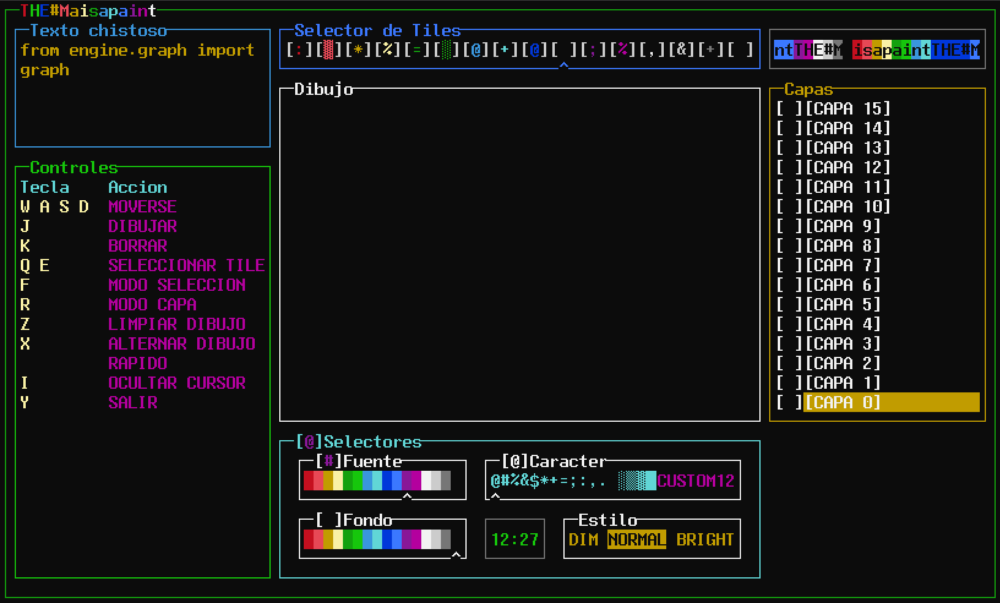
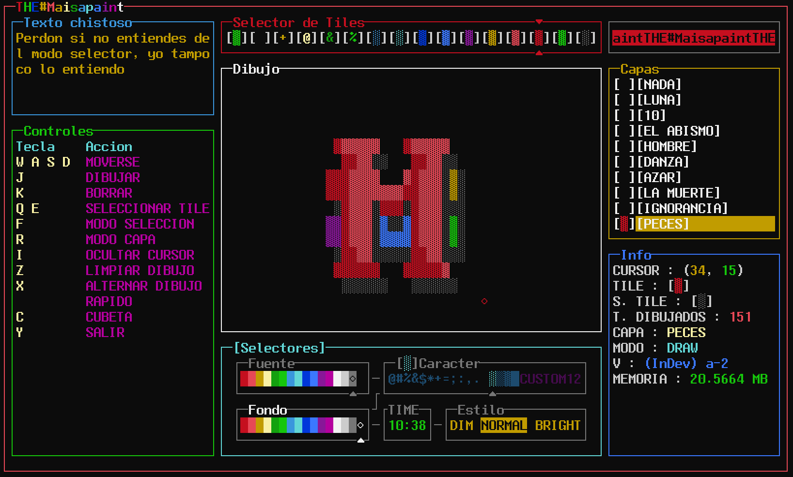

# THE-Maisapaint
```
┌───────────┬─┬─┐┌─────┬─────────────────────┐  ┌────┐
└─┐ ┌─┬─┬───┘ ╵ └┤ ╷ ╷ │ ──┬───┬───┬─┬───┐ ┌─┘┌─┴─── ├─┐
  │ │ ╵ │ ──  * ─┤ │ │ ├─┐ │ * │ * │ │ ╷ │ │  │ ┌────┘ │
  │ │ ╷ │ ──┐ ╷ ┌┴─┴─┴─┴─┘ │ ┌─┤ ╷ │ │ │ │ │  └─┤ ───┬─┘
  └─┴─┴─┴───┴─┴─┴──────────┤ │ └─┴─┴─┴─┴─┴─┘    └────┘
                           └─┘
```

Un pedazo de  paint de CMD hecho como pasatiempo
Ojala que lo disfruten y hagan obras de arte bastante buenas

```python
from core.maisapaint import Maisapaint

maisapaint = Maisapaint()
maisapaint.run()
maisapaint.makeAMasterPiece()
```
Un pedazo de  paint de CMD hecho como pasatiempo


===

